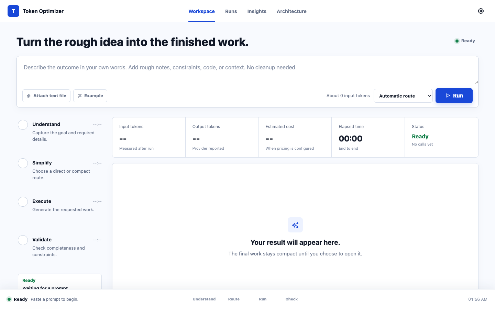

# Token Optimizer

Token Optimizer turns a rough request into finished work through adaptive LLM routing, compact handoff contracts, deterministic quality checks, and an inspectable execution trace.

[**Open the live app**](https://tok-pi-gilt.vercel.app) · [Explore the code graph](https://tok-pi-gilt.vercel.app/code-graph)



## What It Does

- Chooses the leanest valid path for each request: direct execution, a compact contract, or a verified workflow.
- Streams understandable progress through the browser and reports provider usage, cost when available, and estimated context saved.
- Checks explicit output requirements with deterministic acceptance gates and can apply conservative, zero-call repairs.
- Keeps raw provider output and secrets behind an allowlisted server boundary while preserving a useful local audit trail.
- Includes a Manifest V3 side-panel extension for preparing prompts beside Gemini and ChatGPT.

## Tech Stack

| Layer | Technologies |
| --- | --- |
| Client | Vanilla HTML, CSS, and JavaScript; Chrome Manifest V3 |
| Server | Node.js 18+, Vercel Functions, Server-Sent Events, Zod |
| AI workflow | OpenAI/Groq adapters, adaptive routing, typed handoff contracts, deterministic acceptance gates |
| Operations | Optional Upstash Redis coordination, metadata-only telemetry, GitHub Actions |

## Run Locally

```bash
git clone https://github.com/adiarora06/TokenOptimizer.git
cd TokenOptimizer
npm ci
npm start
```

Open [http://127.0.0.1:8787](http://127.0.0.1:8787). The interface and deterministic prompt preparation work without provider keys; add optional keys as described below to execute hosted model calls.

## Product Shape

- **Workspace first**: one prompt box, one run action, live stage updates, measured usage, and a collapsed final result.
- **Inspectable preflight**: the local Prompt Inspector shows the canonical route, constraints, complexity, planned calls, input budget, and policy version before execution.
- **Deterministic acceptance gates**: every generated result is checked locally for explicit machine-testable requirements, with pass/fail evidence and no extra model call.
- **Free local repair loop**: failed gates can trigger conservative mechanical repairs and a deterministic re-check, with zero additional model calls.
- **Independent readiness state**: execution and output quality are reported separately as `executionStatus` and `qualityStatus`, so a completed call cannot hide a result that still needs review.
- **Safe public results**: API responses are allowlisted, recursively secret-redacted, and never expose raw executor, contract-builder, generation, or repair-source outputs.
- **Funded-run controls**: production server-funded calls are fail-closed behind bearer/public-demo policy, bounded concurrency and daily allowances, and idempotent single-flight suppression. An optional Redis REST driver makes these controls deployment-wide.
- **Adaptive execution**: simple prompts take one direct call, multi-part work uses a compact contract, and high-risk work can add verification.
- **Provider-agnostic UI**: model routing, fallback, timeouts, usage normalization, and optional cost estimates stay on the server.
- **Runs and Insights**: local prompt history, audit traces, session totals, all-time totals, route mix, status mix, and token charts.
- **Inspectable architecture**: agent responsibilities and the hub-and-spoke contract graph share one Architecture page.
- **Graphify code map**: the public app includes a searchable knowledge graph of real files, functions, calls, tests, adapters, and deployment routes.
- **Assistant wrappers**: a Manifest V3 side panel prepares and inserts prompts for Gemini and ChatGPT with zero duplicate provider calls.

## Source Map

- `outputs/workspace.html`: semantic structure for the primary one-shot workspace.
- `outputs/workspace.css`: responsive light/dark application UI and live run states.
- `outputs/workspace.js`: streaming client, local history, usage rendering, file context, result dialog, and continuation flow.
- `outputs/app-nav.css`: shared stable navigation for internal product pages.
- `outputs/open-source.html`: readable workings page for architecture and contribution context.
- `outputs/agent-structure.html`: agent roles plus hub-and-spoke information graph.
- `graphify-out/graph.html`: interactive Graphify repository map published at `/code-graph`.
- `graphify-out/graph.json`: machine-readable repository graph for assistants and MCP tools.
- `graphify-out/GRAPH_REPORT.md`: generated architecture report with hubs, communities, and high-impact connections.
- `outputs/prompt-history.html`: prompt history and side-panel audit log.
- `outputs/stats.html`: session and all-time usage insights.
- `extensions/gemini-token-optimizer`: local unpacked Chrome extension for Gemini and ChatGPT.
- `extensions/gemini-token-optimizer/ADAPTERS.md`: reusable site-adapter contract for future AI assistants.
- `extensions/gemini-token-optimizer/PUBLISHING.md`: Chrome Web Store readiness checklist.
- `optimizer-core.cjs`: public entry point for the optimizer core modules.
- `shared/prompt-compiler.js`: versioned browser-and-server source of truth for token estimation, constraint signals, route selection, call planning, and preflight contracts.
- `scripts/sync-prompt-compiler.cjs`: synchronizes the canonical compiler into the web and extension packages; artifact equality is enforced by tests.
- `core/`: focused modules for provider adapters, adaptive routing, handoff preparation, the prompt library, secret removal, usage accounting, and the workflow runners.
- `core/acceptance.cjs`: explicit acceptance-gate compilation, evaluation, and conservative zero-call repair rules.
- `core/public-result.cjs`: allowlisted public workflow projection and recursive configured-secret redaction.
- `core/telemetry.cjs`: bounded metadata-only run and provider-attempt telemetry with structured production logging.
- `core/telemetry-analysis.cjs`: shared deployment-window aggregation, p95 metrics, and alert-policy evaluation.
- `scripts/telemetry-report.cjs`: JSON/NDJSON/Vercel-log analyzer for deployment-wide operator reports and CI alert gates.
- `request-guard.cjs`: payload validation, response hardening, funded-run authorization, bounded throttling/concurrency/budgets, and idempotent single-flight control.
- `shared-request-guard.cjs`: optional Upstash Redis REST coordination with atomic limits, expiring leases, encrypted cross-instance replay, and a fail-closed production configuration.
- `PRODUCTION_SECURITY.md`: application limits and the staged Vercel Firewall rollout runbook.
- `api/optimize-stream.js`: hosted server-sent event endpoint for live run progress.
- `api/prepare-handoff.js`: deterministic, zero-model-call prompt preparation for wrappers.
- `server.cjs`: local static server and streaming API implementation.
- `api/*.js`: Vercel function entrypoints, including workflow, compatibility, health, and streamed run routes.

## Optional Provider Keys

Copy the example env file and add rotated keys:

```bash
cp .env.local.example .env.local
```

```env
GROQ_API_KEY=
OPENAI_API_KEY=
```

The browser never stores provider keys. Server routes handle model calls and keep the UI provider-agnostic.

Production server-funded routes require `TOKEN_OPTIMIZER_ACCESS_TOKEN` bearer authentication unless `TOKEN_OPTIMIZER_ALLOW_PUBLIC_FUNDED=1` is explicitly enabled. Offline work incurs no provider spend; BYOK work is billed to the caller's provider account and does not consume the deployment's provider allowance. Coordination defaults to dependency-free process memory; set `TOKEN_OPTIMIZER_SHARED_GUARD_BACKEND=upstash` with the documented Redis credentials and separate encryption secret for deployment-wide limits. See `PRODUCTION_SECURITY.md` for the full policy and deployment-mode table.

## Typed Contract Workflow

The core optimization pattern is:

1. Read the raw prompt once.
2. Choose the leanest valid route: direct, contract, or full verification.
3. Extract goal, facts, constraints, decisions, sources, open questions, and next action when a contract is useful.
4. Send downstream nodes compact state instead of the full transcript.
5. Save history and audit trail so the run can be inspected later.

## Execution Flow

The browser and orchestration layers are intentionally separate:

1. The browser runs the same versioned prompt compiler used by the server while the user types.
2. The workspace posts one validated request to `/api/optimize-stream`.
3. The server emits understandable Understand, Route, Simplify, Execute, and Validate events.
4. The adaptive router selects a direct, contract, or verified workflow.
5. Deterministic acceptance gates check output presence, secret leakage, and explicit format or content requirements.
6. Failed gates enter the free local repair loop; only a safer candidate with fewer failures is adopted, then the same gates run again.
7. Execution state (`completed`, `prompt_ready`, `provider_error`, or `cancelled`) and quality state (`passed`, `repaired`, `needs_review`, or `not_run`) are emitted independently.
8. A public-result projection removes internal stage outputs and recursively redacts configured secrets before the response crosses the API boundary.
9. Provider-reported usage is normalized across every model call and returned with the final result.
10. The browser stores prompt history, audit traces, execution and quality status, acceptance and repair status, and usage summaries locally.

## Usage Semantics

- **Input/output tokens** use provider-reported totals when available and are labeled as estimates otherwise.
- **Context saved** compares the compact prompts against the planned repeated-input baseline; it is always labeled as an estimate.
- **Cost** appears only when a provider reports it or model pricing rates are configured on the server.
- **Secrets** matching supported key and credential patterns are removed before model transmission and from provider errors before they reach browser history.
- **Contracts** are parsed as JSON and schema-validated before an executor can use them; malformed or truncated contracts fall back to compact local state.
- **Provider boundaries** reject private or reserved production addresses, validate and pin DNS results, reject redirects, and cap output tokens and response bytes.
- **Timeouts** use one workflow-wide deadline, so adding contract or verification stages cannot multiply the requested time budget.
- **Acceptance gates** compile only explicit deterministic checks—such as JSON validity and keys, named functions, test counts, word caps, forbidden literals, endpoint presence, and secret absence—and report evidence without another provider call.
- **Code/test detection** requires fenced or line-structured implementation syntax and executable test constructs; ordinary prose containing words such as `function`, `class`, or `test(foo)` does not pass as code or a test.
- **Local repair** handles only mechanical changes: supported-secret redaction, JSON extraction and normalization, exact keys and explicit values, Markdown removal, forbidden literals, and one unambiguous integer. It never invents facts, tests, code, endpoints, columns, or missing content. A repair replaces the original only when it reduces failed gates and introduces no new gate failure.
- **Public projection** returns the final checked answer and allowlisted metadata. Raw executor output, raw contract output, provider generations, and unknown future intermediate fields are omitted even when a local repair changed the final answer.

## Production Telemetry

Every provider call and completed workflow emits an allowlisted metadata event. Events contain route, stage, provider, execution status, quality status, outcome, classified failure code, fallback attempt number, latency, token counts, cost when known, redaction count, acceptance-gate outcome/counts, repair status/action count, and a trace ID. Prompt text, generated output, repair content, model names, provider error text, credentials, source labels, and session IDs are never copied into telemetry.

`GET /api/system-overview` returns aggregate process-local totals without individual events. The in-memory buffer is bounded (200 events by default), so it is useful for local operation and warm-instance diagnostics rather than durable analytics. In production, newline-delimited JSON events are enabled by default for the deployment log collector; set `TOKEN_OPTIMIZER_TELEMETRY_LOG=0` to disable them or `=1` to enable them outside production. Set `TOKEN_OPTIMIZER_TELEMETRY_MAX_EVENTS` between 10 and 5,000 to change the diagnostic window.

Build an actionable report from a deployment log export with `npm run telemetry:report -- --input <path|->`. It calculates failure and retry rates, p95 provider latency, optional spend limits, and warning/critical status. See `TELEMETRY_OPERATIONS.md` for Vercel commands, thresholds, drain guidance, and alert response.

## Evaluation And Regression Baseline

Run the deterministic benchmark before changing routing, handoff preparation, contracts, or token accounting:

```bash
npm run eval
```

The benchmark is free and checks expected routing, constraint retention, secret removal, repeat-preparation stability, zero-call preparation, and aggregate prompt-token movement across representative general, structured, code, API, workflow, security, and high-impact tasks. A separate compiler-parity suite runs the same prompts and preferences through the Node, browser, worker, and extension artifacts so preflight cannot silently drift from execution. Both are part of `npm test`.

An opt-in live comparison runs the same objective output checks against one raw single-call baseline and the adaptive workflow:

```bash
npm run eval:live -- --provider openai
```

Live mode uses configured provider credentials and can incur multiple model calls. See `evals/README.md` for case design, thresholds, JSON output, and focused diagnostics.

## Sidecar Wrapper Loop

The background mode is for working beside an active LLM or IDE:

1. Capture the active messy prompt.
2. Prepare it locally through the zero-call handoff endpoint.
3. Review the measured original and prepared token counts.
4. Insert the compact prompt into the target chat box or IDE agent.
5. Review the result and save an audit trail when needed.

## Graphify Code Graph

The repository ships with a generated Graphify knowledge graph, so the file and dependency structure can be explored without reading every source file first.

Open the published graph:

```text
https://tok-pi-gilt.vercel.app/code-graph
```

Regenerate the graph after architecture changes:

```bash
uvx --from 'graphifyy==0.9.22' graphify extract . --code-only
uvx --from 'graphifyy==0.9.22' graphify cluster-only .
```

## Assistant Extension MVP

Load the extension locally:

1. Open `chrome://extensions`.
2. Enable **Developer mode**.
3. Click **Load unpacked**.
4. Select `extensions/gemini-token-optimizer`.
5. Open `https://gemini.google.com` or `https://chatgpt.com` and click the extension icon.

The extension uses a Chrome side panel. It does not auto-send messages and it does not run a provider model while preparing the prompt. Gemini and ChatGPT ship as reference adapters; the internal adapter bridge can support additional assistants by adding one `adapters/<site>.js` file and a `content_scripts` entry, without changing the core workflow.

## Contributing Principle

Keep the default user path simple. Put complexity behind tabs, expandable panels, or the open-source workings page.

## License

Released under the [MIT License](LICENSE).
